Syncron
=======

Syncron is a dashboard for your cron jobs. It collects run information
including environment, timings, and logs from each job and presents them in
an easy to read web application.

Architecture
------------

Syncron consists of a client and a server. The client runs on each machine
you want to collect job data from. It is designed to act as a "passthrough
shell"--you tell cron to use it as your shell (via the `SHELL` environment
variable, and it runs your code collects the output and sends it off to the
server.

The server is an http server. It acts as both a server for the Syncron web
application to view logs and as the backend api server that the syncron
clients deliver job info to.

The client and the server are compiled into the same binary. See [the
syncron cli reference](cli) for more information.

